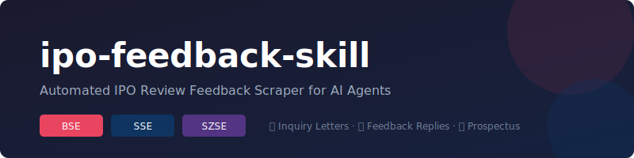

<p align="center">
  
</p>

<p align="center">
  <em>Automated IPO review feedback scraper for AI agents</em>
</p>

<p align="center">
  
  
  
  
  
</p>

---

## Features

- **All three exchanges**: BSE, SSE, SZSE
- **Three document types**: inquiry letters, feedback replies, prospectus registration drafts
- **Auto scraping**: Fetch data via public APIs, no browser required
- **PDF download**: Parallel downloading for speed
- **Text extraction**: Parse PDF content into plain text using pdfplumber
- **Content analysis**: Extract questions from inquiry letters, topics from replies, main business and financials from prospectus
- **Auto cleanup**: Old downloads (>30 days) automatically moved to trash
- **Structured output**: Markdown (for terminal reading) and JSON (for Agent consumption)
- **Flexible time range**: Default to yesterday, max 40 days, customizable via `--days`

## What is this? What is this not?

This is a **Skill**, not an Agent. It only handles data collection and parsing — no LLM calls. Configure it in your own Agent, and let the Agent's LLM generate analysis reports.

```
Your Agent (with LLM)
    └── calls ipo-feedback skill
            ├── scrape exchange data
            ├── download PDFs
            ├── parse text
            └── output structured data → back to Agent → LLM generates report
```

## Supported exchanges

| Exchange | Inquiry Letter | Feedback Reply | Registration Draft |
|----------|---------------|----------------|-------------------|
| BSE | ✅ | ✅ | ✅ |
| SSE | — | ✅ | ✅ |
| SZSE | — | ✅ | ✅ |

- BSE publishes all three document types
- SSE and SZSE only publish company replies and registration drafts, not the original inquiry letters
- Registration drafts = 招股说明书注册稿

## Prerequisites

- **Python >= 3.10**
- **pip** (Python package manager)
- Network access to BSE, SSE, SZSE websites

## Install

```bash
# 1. Clone the repo
git clone https://github.com/corylcr/ipo-feedback-skill.git
cd ipo-feedback-skill

# 2. Create a virtual environment
python3 -m venv venv
source venv/bin/activate  # macOS / Linux
# venv\Scripts\activate   # Windows

# 3. Install
pip install -e .
```

After installation, you'll have the `ipo-feedback` CLI tool.

## Quick start

```bash
# Fetch yesterday's feedback from all exchanges (default)
ipo-feedback fetch --exchange all

# Fetch BSE only
ipo-feedback fetch --exchange bse

# Fetch last 7 days
ipo-feedback fetch --exchange all --days 7

# Output JSON (for Agent consumption)
ipo-feedback fetch --exchange all --format json
```

## Commands

### `ipo-feedback fetch`

Scrape exchange IPO feedback data, download and parse PDFs.

```text
ipo-feedback fetch [OPTIONS]

Options:
  -e, --exchange {bse,sse,szse,all}
                        Exchange to scrape (default: bse)
  -d, --days N          Days to look back, max 40 (default: 1, i.e. yesterday)
  -f, --format {markdown,json}
                        Output format (default: markdown)
  --no-download         List files only, don't download PDFs
  --no-parse            Download PDFs but skip text extraction
  -h, --help            Show help
```

### `ipo-feedback schedule` (Optional)

Set up a daily cron job to automatically fetch IPO feedback at 9:30 AM.

```bash
ipo-feedback schedule
```

This is an **optional** feature. When you run this command, it will ask if you want to set up the schedule. If yes:
- Creates a cron job that runs daily at 9:30 AM
- Fetches the previous day's feedback from all exchanges
- Saves output to `schedule.log` in the project directory

To view: `crontab -l`
To remove: `crontab -e` (delete the ipo-feedback line)

> **Note**: Different Agents may have their own scheduling mechanisms. This cron job is just one option for standalone use.

### Examples

```bash
# Daily routine: fetch yesterday's updates from all exchanges
ipo-feedback fetch --exchange all

# BSE this week, list only
ipo-feedback fetch --exchange bse --days 7 --no-download

# JSON output for scripting
ipo-feedback fetch --exchange szse --days 3 --format json > report.json

# Set up auto-fetch schedule
ipo-feedback schedule
```

### ⚠️ BSE data pit and `--days 2` recommendation

When scraping all three exchanges, **always use `--days 2`** instead of `--days 1`:

```bash
ipo-feedback fetch --exchange all --days 2
```

The BSE API may return empty results with `--days 1`, causing all BSE projects to be lost. Using `--days 2` ensures BSE data is captured reliably. Even with `--days 2`, BSE may occasionally return 0 projects (API maintenance or data delay) — this is normal.

### Empty day handling

Sometimes all three exchanges have no new IPO feedback documents on a given day (e.g., no new inquiry letters, replies, or registration drafts published). When integrating with an Agent or cron job:

1. Run the CLI and check if the total project count is 0
2. If 0 projects across all exchanges, **skip PDF download and analysis** — there is nothing to process
3. Optionally create a brief notice (e.g., a Feishu/Slack message) stating: *"No new IPO feedback documents published on {date} across all three exchanges."*
4. This avoids wasting time downloading and analyzing empty results

## Configuration

### Integrate with your Agent

Add the skill to your Agent config:

```yaml
# Example: Claude Code skill config
skills:
  - name: ipo-feedback
    command: "cd /path/to/ipo-feedback-skill && ipo-feedback fetch --exchange all --days 1 --format json"
    output: json
```

The Agent reads the JSON output and uses its LLM to generate summary reports.

## Output Formats

### Markdown (`--format markdown`, default)

CLI outputs raw extracted text in code blocks. Agent uses LLM to generate the final report.

### JSON (`--format json`, for Agent consumption)

```json
{
  "exchange": "bse",
  "date_range": "2026-06-17 ~ 2026-06-18",
  "projects": [
    {
      "company_name": "Company Name",
      "stock_code": "872824",
      "inquiry": null,
      "reply": {
        "title": "Second round inquiry reply",
        "publish_date": "2026-06-17",
        "pdf_url": "https://...",
        "pdf_path": "downloads/BSE/...pdf",
        "content_text": "(extracted plain text)"
      },
      "prospectus": {
        "title": "Prospectus (registration draft)",
        "publish_date": "2026-06-18",
        "pdf_url": "https://...",
        "pdf_path": "downloads/BSE/...pdf",
        "content_text": "(extracted plain text)"
      }
    }
  ]
}
```

## Auto cleanup

Each time `ipo-feedback fetch` runs, PDF files older than **30 days** are automatically moved to the system trash (not permanently deleted). The cleanup summary is shown at the end of the report.

## Project structure

```
ipo-feedback-skill/
├── README.md
├── pyproject.toml
├── ipo_feedback/
│   ├── cli.py              # CLI entry point
│   ├── config.py            # Global config
│   ├── models.py            # Data models
│   ├── downloader.py        # PDF downloader
│   ├── parser.py            # PDF text extraction
│   ├── analyzer.py          # Inquiry/reply content analyzer
│   ├── prospectus.py        # Prospectus key info extractor
│   ├── cleanup.py           # Auto-cleanup old files
│   └── exchanges/
│       ├── base.py          # Exchange base class
│       ├── bse.py           # BSE
│       ├── sse.py           # SSE
│       └── szse.py          # SZSE
└── downloads/               # PDF download directory (auto-created)
    ├── BSE/
    ├── SSE/
    └── SZSE/
```

## 📐 Document Structure Guide (for Agent Integration)

This tool outputs raw extracted text. Your Agent (LLM) is responsible for intelligent analysis and report generation. Below are the standard document structures for each exchange to help your Agent locate key information efficiently.

### Inquiry Letter (审核问询函)

Standardized across all exchanges:

1. **Opening**: Addressed to issuer + sponsor, requesting response within 20 business days
2. **Body**: Numbered "问题1", "问题2", etc., each containing:
   - Question title (e.g., "业绩增长可持续性")
   - Background info (citing application documents)
   - Specific requirements ("请发行人：（1）...（2）...")
3. **Closing**: Request for sponsor/auditor verification

**Extraction**: Split by "问题N" pattern. Each question title = a risk signal. No need to read the full document.

### Feedback Reply (问询回复)

Standardized across all exchanges:

1. **Opening**: Summary of reply
2. **Body**: Numbered "问题1", "问题2", matching inquiry questions
3. **Key marker**: `【回复】` followed by the company's response

**Extraction**: Find `【回复】` markers, extract the core conclusions.

### Prospectus Registration Draft (招股说明书注册稿)

Structure varies by exchange:

| Content | BSE (北交所) | SSE (上交所) | SZSE (深交所) |
|---------|-------------|-------------|--------------|
| Overview | 第二节 概览 | 第二节 概览 | 第二节 概览 |
| Main Business | **第五节** "发行人主营业务情况" | **第二节** "发行人主营业务经营情况" | **第二节** "发行人主营业务经营情况" |
| Financials | "主要财务数据和财务指标" | "发行人**报告期**的主要财务数据和财务指标" | "发行人**报告期内**的主要财务数据和财务指标" |
| Financial Unit | 元 (yuan) | 万元 (10K yuan) | 万元 or 亿元 |
| Risk Factors | 第三节 风险因素 | 第三节 风险因素 | 第三节 风险因素 |

**Key differences**:
- BSE's main business section is in **第五节** (not 第二节), title is "发行人主营业务情况" (no "经营")
- SSE/SZSE's main business is in **第二节 概览**, title is "发行人主营业务经营情况"
- Financial data titles differ slightly — use fuzzy search for "主要财务数据和财务指标"

**Extraction strategy** (search by section name, not page number):

1. **Main Business**: Search for "发行人主营业务情况" or "发行人主营业务经营情况", extract first 500 chars
2. **Financials**: Search for "主要财务数据和财务指标" or "主要财务指标", find nearby table, extract Revenue (营业收入), Net Profit (净利润), Gross Margin (毛利率), ROE (净资产收益率) — **mandatory metrics**
3. **Risk Factors**: Search for "风险因素", extract key risk titles
4. **⚠️ NEVER write "未提取到" or "需进一步读取" in the report — if not found in overview, search the full text; if still missing, extract from narrative text**

**Mandatory financial metrics** (report is incomplete without these):

| Metric | Chinese | Format |
|--------|---------|--------|
| Revenue | 营业收入 | X.XX亿 or XXXX万 |
| Net Profit | 净利润 | X.XX亿 or XXXX万 |
| Gross Margin | 毛利率 | XX.XX% |

### Recommended Report Format (Chinese)

```markdown
# IPO 反馈报告
**时间范围**: YYYY-MM-DD ~ YYYY-MM-DD

共更新 **N** 个项目: 问询函 **X**, 注册稿 **Y**

---

## {公司名} ({股票代码})

### {问询函 / 注册稿}

- 发布日期: YYYY-MM-DD
- PDF: [{标题}]({URL})

**{智能提取的关键信息}**

**关注点:**
> {Agent 分析的风险和亮点}

---

## 快速筛选

| 公司 | 交易所 | 亮点 | 风险 | 关注度 |
|------|--------|------|------|--------|
| ... | BSE/SSE/SZSE | ... | ... | ⭐⭐⭐⭐⭐ |
```

## ⚠️ Disclaimer

All data and files obtained through this project are from **publicly available information** on official exchange websites. By using this project, you acknowledge and agree to the following:

1. **For personal learning and research only**. Commercial use is strictly prohibited.
2. **You shall not use the data obtained from this project for any form of commercial profit**, including but not limited to selling data, providing paid services, etc.
3. **You shall not perform large-scale, high-frequency scraping** on exchange websites, so as not to affect their normal operation. Please control the scraping frequency appropriately.
4. **All legal risks and liabilities arising from the use of this project shall be borne by the user**, and the project developer shall not be held responsible.
5. Content on exchange websites is copyrighted. Downloaded PDF files belong to their original rights holders.
6. If the exchange websites' terms of use or robots.txt prohibit such scraping activities, please stop using this project immediately.

**This project is provided "AS IS", without warranties of any kind, express or implied.**

## License

MIT
